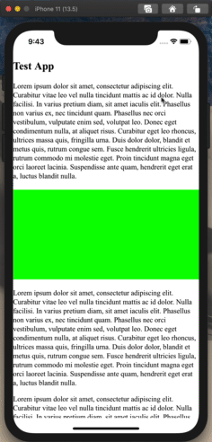

# WKWebViewDemoApp (Fork)

## Introduction

This fork of [rckim77/WKWebViewDemoApp](https://github.com/rckim77/WKWebViewDemoApp) demonstrates an approach to overlaying a number of UIViews on top of corresponding "ad-placeholder" elements within a web page:



This is based on an approach that I described [via Slack](https://nytimes.slack.com/archives/C02CBD553/p1591976624220600?thread_ts=1591637639.184000&cid=C02CBD553).

## Project Setup

1. Clone this repo.
2. Setup and start the `webapp` at http://localhost:8888/:
   ```bash
   cd webapp
   yarn
   yarn start
   ```
3. Open WKWebViewDemoApp.xcodeproj in Xcode.
4. Build and run the Xcode project in iOS Simulator.
5. In iOS Simulator, scroll the webview. A series of green boxes should be drawn above it, with their positions and sizes in sync with the "ad-placeholder" elements in the web page itself.

## Architecture / Design

1. We create a UIViewController with a WKWebView and a WKUserContentController. To the latter we [add a script message handler named `adPlaceholderTracker`](./WKWebViewDemoApp/ViewController.swift#L33), which exposes a window global function named `window.webkit.messageHandlers.adPlaceholderTracker.postMessage()` to the web content.
2. Within the webview, we [set up a `window.onmessage` event listener](https://github.com/kohlmannj/WKWebViewDemoApp/blob/91ee589/webapp/src/index.ts#L47) that listens for messages with specific string values. This allows us to use messages as a convention for communicating between native and web code.
3. Back in native code, we use a WKNavigationDelegate extension on the view controller to call `window.postMessage('startTrackingAdPlaceholders')` once the web page has finished loading.
4. Once the web page receives the `'startTrackingAdPlaceholders'` message, it [starts tracking the `.ad-placeholder` elements](https://github.com/kohlmannj/WKWebViewDemoApp/blob/91ee589/webapp/src/index.ts#L23). We use a `requestAnimationFrame()` callback for each element to get its `DOMRect` (i.e. `element.getBoundingClientRect()`) and then call `window.webkit.messageHandlers.adPlaceholderTracker.postMessage()`.

- We [stringify the message contents](./webapp/src/index.ts#L10) beforehand, but you can see the shape of the message here: [AdPlaceholderTrackerMessage](./webapp/globals.d.ts#L21-L25)

5. Back in native code, we use a WKScriptMessageHandler extension and [`userContentController(:_didReceive:)`](https://developer.apple.com/documentation/webkit/wkscriptmessagehandler/1396222-usercontentcontroller) to receive the message in string form from the web app. We [deserialize the message](https://github.com/kohlmannj/WKWebViewDemoApp/blob/91ee589/WKWebViewDemoApp/ViewController.swift#L74) into the equivalent native data structure using [JSONSerialization.jsonObject(with:options)](https://developer.apple.com/documentation/foundation/jsonserialization/1415493-jsonobject) and then do the following:

- If the message says to **add** an ad placeholder, we instantiate a new [AdObserver class](./WKWebViewDemoApp/AdObserver.swift#L15) and add it to the view controller's `self.ads` dictionary
- If the message says to **update** an ad placeholder, we ensure that we know about this ad already, and then update the corresponding AdObserver instance's view's `frame` by calling [`AdObserver.update()`](./WKWebViewDemoApp/AdObserver.swift#L35-L37)
- If the message says to **remove** an ad placeholder, we remove the corresponding AdObserver instance from the view controller's `self.ads` dictionary.

## Possible Performance Optimizations

There are numerous possible performance optimizations, including:

- Replace `requestAnimationFrame` callbacks with `window.onscroll` and `window.onresize` callbacks
- Is there a way to avoid having to stringify the message data?
- Is there a way to position the native views within the same coordinate space of the web page, i.e. by using `element.offsetLeft` and `element.offsetTop` instead of their `DOMRect`s' `x` and `y` coordinates? If so, this may avoid "position skewing", i.e. wherein the native views' positions are slightly behind the positions of the placeholder elements within the webview

## Notes on a Potential Cross-Platform Approach

Additionally, note that Android's rough equivalent to WKUserContentController's `add()` method (to expose a message-passing interface to the webview) is [`WebView.addJavascriptInterface()`](<https://developer.android.com/reference/kotlin/android/webkit/WebView#addJavascriptInterface(kotlin.Any,%20kotlin.String)>). Unlike `WKUserContentController.add()`, the Android method exposes an object globally. The example web app in this project contains [a bit of boilerplate code](./webapp/src/index.ts#L4-L10) which checks for the existence of both the global `adPlaceholderTracker` and `window.webkit.messageHandlers.adPlaceholderTracker` before attempting to call either object's `postMessage()` method. In this way, you can imagine implementing the equivalent native code on Android, while ensuring that most of web app code is opaque to these implementation differences.

## Original Repo

- [rckim77/WKWebViewDemoApp](https://github.com/rckim77/WKWebViewDemoApp)
- Companion repo to the Medium article [JavaScript Manipulation on iOS Using WebKit](https://medium.com/capital-one-developers/javascript-manipulation-on-ios-using-webkit-2b1115e7e405)
